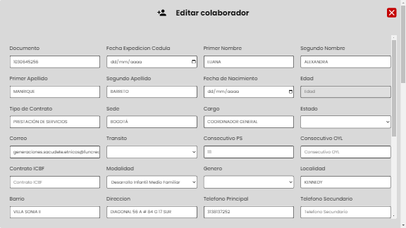

# Fundación Social Crecer

El siguiente proyecto fue desarrollado con Next.js, una popular librería de React, con el objetivo de simplificar la gestión de usuarios y la expedición de certificados laborales en formato PDF. El proyecto permite la carga masiva de usuarios a través de un archivo Excel, lo que reduce significativamente el tiempo necesario para ingresar la información manualmente. Además, una vez que los usuarios están registrados en el sistema, se puede expedir automáticamente el certificado laboral en formato PDF, el cual se puede enviar al correo electrónico de la persona de forma rápida y sencilla. Este proyecto ofrece una solución eficiente para la gestión de usuarios y la expedición de certificados laborales, lo que resulta especialmente útil en entornos donde la rapidez y la precisión son fundamentales.

<a href="https://www.notion.so/Fundaci-n-Social-Crecer-090f7f491cf045288143008d7dfe548f?pvs=4"><b>Documentación y explicación del código a detalle</b></a>

<a href="https://github.com/ElPardo16/proyecto-final-fsc-backend"><b>Repositorio Backend</b></a>

## Despliegue e instrucciones de uso.

- Haz clic en el enlace de despliegue proporcionado por el desarrollador del proyecto.

- Una vez que se carga la página, se te pedirá que inicies sesión como administrador. Proporciona las credenciales de inicio de sesión para acceder al panel de administración.
   
- Una vez que hayas iniciado sesión, podrás acceder al panel de gestión de usuarios. En esta sección, puedes filtrar a los colaboradores por nombre, identificación o buscar personas específicas. Además, puedes ordenar a los colaboradores según diferentes criterios, lo que facilita la gestión de grandes cantidades de ellos.

   

- Puedes importar y exportar la tabla de usuarios en formato Excel, lo que es especialmente útil para cargar o descargar grandes cantidades de información de colaboradores en una sola operación.

- Si necesitas agregar un colaborador individualmente, puedes hacerlo utilizando el formulario de registro proporcionado. Una vez que hayas ingresado la información, este se agregará automáticamente a la tabla de colaboradores.

   

- Si necesitas editar un colaborador existente, puedes hacerlo haciendo clic en el botón "Editar" correspondiente al colaborador  en cuestión. Podrás actualizar la información y guardar los cambios en la tabla.

   

- Si necesitas expedir un certificado laboral para un usuario en particular, puedes hacerlo haciendo clic en el botón "PDF" correspondiente al usuario. El sistema generará automáticamente el certificado laboral en formato PDF, que se puede descargar o enviar por correo electrónico al destinatario.

   
- Si eres un administrador, también puedes crear nuevos usuarios en el sistema utilizando la opción correspondiente.

   

-  Como administrador tambien puedes restablecer las contraseñas de los usuarios en caso de que se olviden o pierdan el acceso a sus cuentas.

   

## Instrucciones para inicar el proyecto a nivel local
- Abre una terminal en tu computadora.

- Navega al directorio donde deseas clonar el repositorio utilizando el comando cd (por ejemplo, cd Documents/Proyectos).

- Copia el enlace del repositorio desde la página de GitHub del proyecto en el botón que dice code.

- Clona el repositorio utilizando el comando git clone y el enlace copiado (por ejemplo, git clone https://github.com/usuario/proyecto.git).

- Una vez que el repositorio se ha clonado en tu computadora, navega al directorio del proyecto utilizando el comando cd (por ejemplo, cd proyecto).

- Instala las dependencias del proyecto utilizando el comando npm install o yarn install, dependiendo del gestor de paquetes que se esté utilizando.

- Inicia el servidor de desarrollo utilizando el comando npm run dev o yarn dev.

- Abre tu navegador web e ingresa la dirección http://localhost:3000 para acceder a la aplicación en el servidor de desarrollo.

En resumen, los pasos para utilizar un proyecto de Next.js desde GitHub son:

         bash
         Copy code
         cd ruta/al/directorio/de/proyectos
         git clone enlace-del-repositorio
         cd proyecto
         npm install
         npm run dev

## Estructura de carpetas

 La estructura de carpetas es una de las herramientas más importantes para lograr una organización eficiente del código, y esto es especialmente relevante en proyectos grandes o complejos. Una buena estructura de carpetas ayuda a mantener el código limpio y ordenado, facilita la colaboración entre diferentes desarrolladores, y hace que sea más fácil de mantener y escalar el proyecto a largo plazo.

 - <b>Estructura de Carpetas Front-end</b>

 Contiene las carpetas por defecto de los proyectos base de nextjs, se eliminan las innecesarias y  crea una carpeta llamada src que contiene todo el proyecto, ésta se subdivide en 6 archivos, dando como resultado la siguiente estructura:

 

1. <u>components:</u>  esta carpeta guarda cada uno de los componentes que conforman el frontend de la página:

   -Login.jsx: este componente contiene el formulario de inicio de sesión a la plataforma, contiene las respectivas validaciones y la encriptación realizada mediante JWT que genera el token único del usuario.

   -AddUser.jsx:  Corresponde al formulario que le permite al administrador crear nuevos usuarios en la página.

   -FormCollab.jsx: corresponde al formulario que permite crear y añadir colaboradores masiva e individualmente. Tambien se encontrará el código respectivamente de la validación de cada campo del formulario.

   -ModalCollab.jsx: en este se encuentra el componente FormCollab.

   -Header.jsx: en éste componente se encuentra la cabecera del proyecto la cual posee un anuncio de bienvenida ayudando al usuario a identificar que rol cumple en la plataforma por ejemplo "bienvenido admin o user". También se aprecia el correo electronico con el que se ha ingresado a la plataforma.

   -Recovery.jsx:Mediante este formulario se pueden cambiar las contraseñas.

   -SendRecovery.jsx:  este componente contiene otro formulario que se encarga de restaurar las contraseñas de los usuarios creados que lo soliciten, se hace enviandole un correo de restablecimiento de contraseña.

   -Table.jsx: éste componente contiene los datos de cada uno de los colaboradores que laboran en la fundación, contiene todos los datos y en una columna fija a la derecha contiene dos botones que corresponden a la funcionalidad de editar y de expedir pdf de certificación laboral.

2. <u>pages:</u> en esta carpeta se ubican las rutas que componen la página web.

   - index.jsx: es la interfax que corresponde al inicio de sesión a la plataforma, por lo tanto es la primera que se renderiza en el proyecto.

   - carpeta dashboard: contiene el índex.jsx que se renderiza después de iniciar sesión y en este se pueden apreciar las funcionalidades principales de la interfáz, los filtros, ordenamiento e input de busqueda, también es donde se puede apreciar la tabla y las opciones para agregar colaboradores.

   - _app.js: es el componente app por defecto propio de los archivos básicos de nextjs.

   - certification.jsx: esta ruta se renderiza al realizar la petición de expedición del certificado laboral del colaborador, al darle click al botón pdf se envía al usuario hacia esta ruta donde observará la vista previa del certificado y tendrá la opción de descargar certificado o enviarlo via correo electrónico.

   - reset.jsx: en esta ruta se renderiza el componente recovery correspondiente a la funcionalidad de cambio de contraseña.

3. <u>styles:</u> esta carpeta contiene un archivo globals.scss correspondiente a los estilos globales de la página web.

4. <u>test:</u> contiene un archivo Recovery.test para realizar las correspondientes pruebas unitarias (testeo) de la página.

5. <u>utils:</u> en esta carpeta se encuentra un archivo tools que contiene funciones que se usan de forma global en los componentes como el map de la data a utilizar, la lectura y mapeo de los datos del excel, la escritura de un nuevo excel si se quieren exportar los datos actualizados de la tabla.

6. <u> Archivo middleware.js:</u>  El middleware se utiliza para verificar si el usuario está autenticado antes de permitir el acceso a ciertas rutas de la aplicación. Si el usuario intenta acceder a la ruta "/dashboard" o "/certification", el middleware verifica si hay un token JWT almacenado en una cookie en la solicitud del usuario. Si no hay un token JWT, el middleware redirecciona al usuario a la página de inicio.

P.D: se utilizaron variables de entorno para la protección de los datos privados manipulados en la aplicación.

-  <b>Estructura de Carpetas Back-end</b>

El back-end del proyecto se encuentra compuesto por 7 carpetas y 3 archivos independientes:

1. <u>controller:</u> esta carpeta contiene los controladores del software, dentro se encuentran 4 archivos:

   - cert.js: Este código es parte de un servidor web que utiliza Node.js y se encarga de generar, descargar y mostrar un archivo PDF en la respuesta del servidor.

   - collaborator.js: Las funciones permiten obtener todos los colaboradores, guardar un nuevo colaborador, eliminar un colaborador existente y actualizar la información de un colaborador. Las funciones que obtienen o modifican la información de la base de datos devuelven una respuesta HTTP que indica si la operación se realizó con éxito o si ocurrió algún error.

   - user.js: Este código contiene varias funciones para trabajar con usuarios. getUser y deleteUser buscan y eliminan usuarios en la base de datos, respectivamente. saveUser crea un nuevo usuario si el correo electrónico no está registrado en la base de datos.

   - email.js:

2. <u>db:</u> contiene un archivo llamado connection.js la cual es responsable de la conección a la base de datos.

3. <u>models:</u> contiene los esquemas de modelo de la base de datos.

   - collaborator.js: Este código define un esquema de MongoDB  utilizando la biblioteca Mongoose de Node.js. El esquema describe una estructura para un documento que es almacenado en una colección llamada 'Collaborator' y especifica los tipos de datos y propiedades permitidos para cada campo. 

   - user.js: Este código utiliza la biblioteca mongoose para definir un esquema de usuario y crear un modelo de usuario en la base de datos. El esquema de usuario define que un usuario debe tener un correo electrónico y una contraseña, y el campo de role es opcional.

4. <u>routes:</u> Contiene las rutas que se emplean en el proyecto y contiene 4 archivos:

   - cert.js: este código define las rutas para descargar, generar y obtener un PDF en la aplicación utilizando Express.js.

   - collaborator.js: este código define las rutas para obtener, editar, guardar, actualizar y eliminar colaboradores en la aplicación utilizando Express.js.

   - email.js: define una ruta para enviar correos electrónicos en la aplicación utilizando Express.js.

   - user.js: este código define rutas para registrar, iniciar sesión, obtener, actualizar y eliminar usuarios en la aplicación.

5. <u>test:</u> esta carpeta contiene el testeo de la página.
   - index.test: Este es un código de prueba que utiliza la librería de pruebas Jest junto con Supertest para probar las funcionalidades de una API web desarrollada con Node.js y Express.Este código de prueba se utiliza para verificar que la API web creada con Node.js y Express funcione correctamente y responda adecuadamente a las solicitudes HTTP.

6. <u>.env.local:</u> Contiene las variables de entorno que se requieren para la página desde el backend.

## Explicación de codigo 

<a href="https://www.notion.so/Fundaci-n-Social-Crecer-090f7f491cf045288143008d7dfe548f?pvs=4"><b>Documentación y explicación del código a detalle</b></a>

